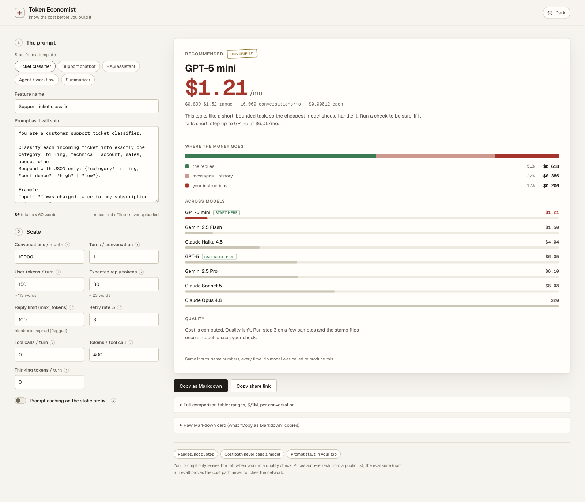

# Token Economist

**Estimate what an AI feature will cost before you put a model name in the
PRD.**

Provider pricing pages list a price per million tokens. A PM still has to
translate that number into a six-turn support chat with history, retrieved
documents, retries, caching, and a model reply. The cheapest option also needs
a quality check before it earns a place in the PRD.

With Token Economist, you turn a draft prompt and rough usage numbers into a
live cost receipt across seven OpenAI, Anthropic, and Google models. You can see
where the money goes, clean up expensive parts of the prompt, and copy the
result into a PRD or ticket. The local Quality Lab lets you test a cheaper
candidate against your own definition of “good enough.”



## A quick example

Suppose you're scoping a customer support chatbot for 80,000 conversations a
month. Pick the support-bot template, paste the draft system prompt, and set the
expected turns, retrieved context, output length, cache rate, and retries. The
receipt updates with a monthly range for each model and names the cheapest
usable starting point.

The recommendation starts with an **UNVERIFIED** stamp. If the price looks good,
run five representative questions through one or two models in Quality Lab.
The stamp changes only when a candidate passes the check you chose.

## Good fits

| Use case | Question you can answer |
|---|---|
| **Customer support chatbot** | What will multi-turn conversations cost at your expected volume, including history growth and retries? |
| **RAG knowledge assistant** | How much does retrieved context add, and would prompt caching or a smaller context cut the bill? |
| **Classification or extraction** | Can a fast, low-cost model return the labels or JSON your workflow needs? |
| **Document summarizer** | How do document length, output caps, and batch pricing change the monthly estimate? |
| **Tool-using agent** | What do tool payloads, extra turns, and reasoning tokens add to each task? |

The built-in templates give each scenario a sensible starting shape. Replace
the sample prompt and add your own scale assumptions.

## What comes out of a run

### Cost receipt

Set conversation volume, turns, prompt caching, tool usage, response length,
retries, and batch work. You can compare per-request and monthly ranges across
model tiers, then see how much each part of the request contributes.

### Prompt fixes with dollar estimates

The prompt review catches duplicated instructions, filler, bloated few-shot
examples, missing output caps, unbounded history, and documents that belong in
retrieval. Each finding shows a token reduction and monthly dollar estimate.
You can apply supported fixes and let the tokenizer measure the result again.

### Cost card for the PRD

Copy a Markdown cost card with the recommended model, projected spend, quality
status, and assumptions. Share a browser link when a teammate needs to inspect
the same scenario. The link stores the prompt in its URL fragment, so treat it
like any document that contains product work.

### Optional quality check, run in your own AI tool

Cost is predictable from tokens. Quality has to be observed. Define “good
enough” as valid JSON, a required phrase, a regex match, or a manual judgment,
and Token Economist exports a **check pack**: a Markdown brief holding the
prompt, the samples, the pass condition, and the reply cap.

Run that pack wherever you already pay for a model — Claude, ChatGPT, Cursor,
anything. It replies with one document; paste the whole thing back into one
box. The app reads the replies out of it, scores them locally, and folds the
result into the recommendation and the cost card. One file out, one file back.

No API key ever enters this app, because it never calls a provider. The spend
stays on your own account, in your own tool, and the app previews it first. The
hosted build is the complete product: nothing is disabled in it.

Evidence is labelled as what it is. Runs carry their source, the card states
that quality evidence is self-reported, and a run stops counting the moment you
edit the prompt or the reply cap it was collected against.

## Quick start

```sh
npm install
npm run dev      # the whole app; it never makes a paid model call
npm run eval     # deterministic offline evaluation suite
npm run build    # production build
```

## How the estimate works

The free path runs in the browser. Token Economist uses an offline o200k BPE
count and provider-specific calibration bands. OpenAI counts use the same BPE;
Anthropic and Google counts remain estimates, so the interface shows a range
instead of false precision.

You supply the expected output length because no calculator can count a reply
before the model writes it. The estimator then prices the full request model:
fixed instructions, user input, conversation history, retrieved data, tools,
reasoning tokens, caching, retries, and batch discounts.

On load, the app requests a public model price list from OpenRouter. It sends no
prompt content. If that request fails, the app uses its dated price snapshot
and tells you which source produced the estimate.

## Architecture

```text
src/core/        deterministic cost, token, lint, share, card, and check-pack logic
src/components/  React interface and live decision receipt
tests/           offline evaluation and boundary tests
DECISIONS.md     append-only product and engineering decision log
```

The model registry lives in `src/core/models.ts`, and the check pack in
`src/core/pack.ts`. There is no server directory, because there is no server.
Start with
[`documentation/architecture.md`](documentation/architecture.md) for the trust
boundaries, permissions, and test map.

## Verification

```sh
npm run lint
npm test
npm run build
```

The default suite makes no paid provider calls. `npm run eval:live` sends test
fixtures to a provider only when you opt in and supply a key.

## Boundaries

Token Economist supports planning before implementation. Runtime model routing,
production billing reconciliation, and global quality leaderboards sit outside
the project. Prices carry a source and date; verify them before you commit a
production budget.

## License

MIT
